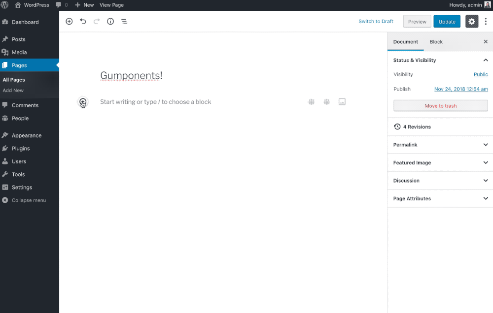

# Advanced Gutenberg components for WordPress.

Gumponents are a bunch of Gutenberg components, built in React, which are meant to be used by WordPress developers while building Gutenberg blocks.

These are not blocks, rather, what you would use to build advanced blocks.

**Please note**: Gumponents may be depracated over time, if something similar or better lands in WordPress core! It is still in beta, so please use accordingly!

## Usage

Download and enable this plugin. You now have Gumponents! 🎉

Make sure to add `gumponents` as a dependency when you're enqueueing your editor assets:

```php
wp_enqueue_script(
    'your-script',
    plugins_url( 'path/to/blocks.js', __FILE__ ),
    array(
        ...
        'gumponents', // That!
        ...
    ),
);
```

When you do this, you get a global `gumponents` object to use in your JavaScript like so:

```js
const { Relationship } = gumponents.components;
```

## Components

Here are the components that are currently part of this bundle, with more on the way.

### Relationship

Choose post types or taxonomies to relate to your post!



#### Post type usage

An example of getting all posts in a custom post type `post` with associated taxonomy terms.

```js
<Relationship
    type="post"
    postTypes="people"
    postTaxonomies={ [ { people_roles: [ 'ceo', 'management' ] } ] }
    items={ people.map( person => person.ID ) }
    onSelect={ people => setAttributes( { people } ) }
    buttonLabel="Select People"
    filter="people_meta"
/>
```

Notice that `filter` property? You can pass a custom filter to customize the results!

The value of the filter property get's appended to two filters:

#### `gumponents_relationship_query`
This filters the `WP_Query` before executing it.

#### `gumponents_relationship_results`
This filters the results before sending it to the editor.

For example:

```php
add_filter( 'gumponents_relationship_results_people_meta', function ( $results ) {
	if ( ! empty( $results ) ) {
		foreach ( $results as $key => $result ) {
			$results[ $key ]['value']->post_meta = array(
				'designation' => get_post_meta( $result['id'], 'designation', true ),
			);
		}
	}
	return $results;
} );
```

You now have post meta along with the posts to work with in the editor 😎

#### Taxonomy usage

An example of getting all taxonomy terms in a custom taxonomy:

```js
<Relationship
    minimal
    type="taxonomy"
    taxonomies="people_roles"
    items={ taxonomy }
    onSelect={ taxonomy => {
        setAttributes( {
            taxonomy: taxonomy.map( tax => tax.term_id ),
        } );
    } }
/>
```

Notice the `minimal` property? That's if you just want the button, without the selected items displayed!

### SelectImage

This provides an easy way to select and work with images in the editor. (More documentation to follow)

Example usage:

```js
<SelectImage
    placeholder="Select an image"
/>
``` 
